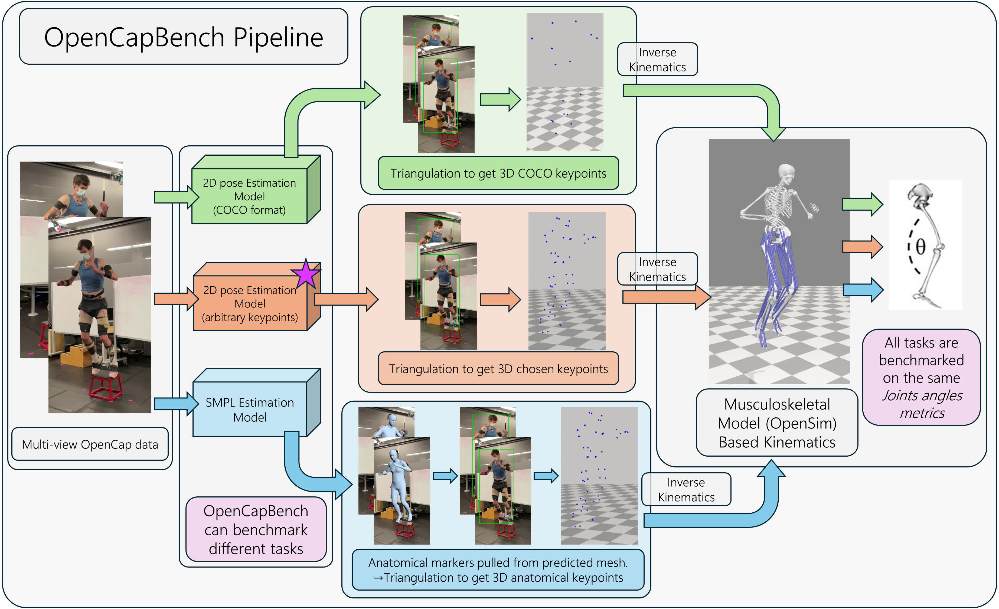
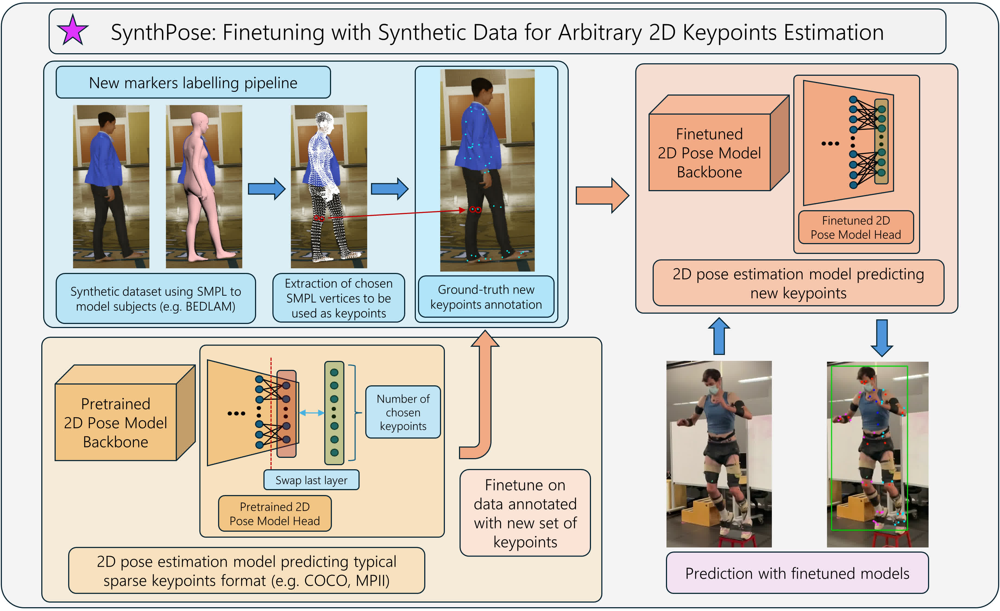
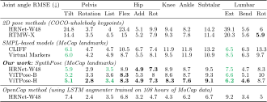
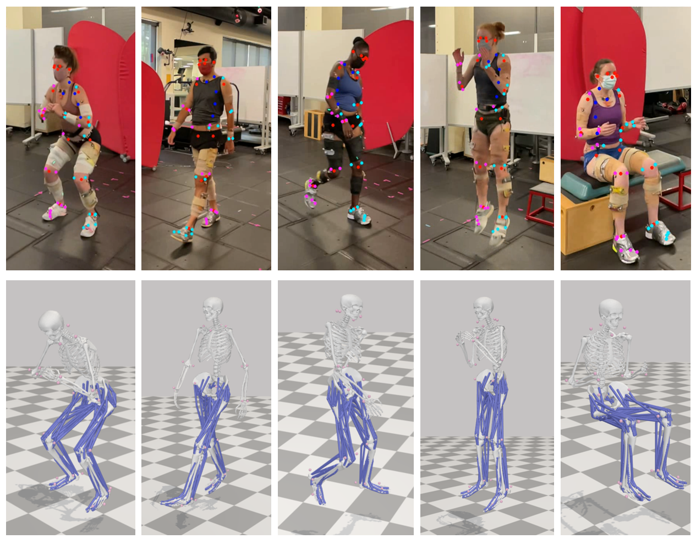
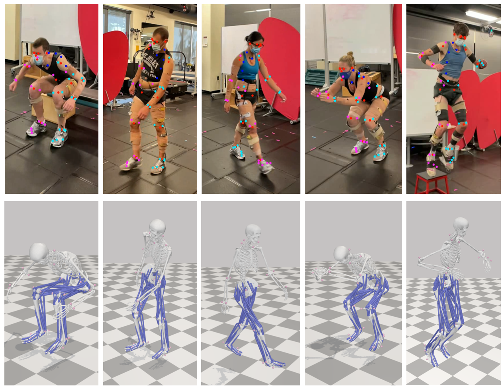

# OpenCapBench

OpenCapBench is a benchmark designed to bridge the gap between pose estimation and biomechanics. It evaluates pose estimation models under physiological constraints using consistent kinematic metrics computed via [OpenSim](https://opensim.stanford.edu/).



---

## Features

- Unified evaluation benchmark for biomechanics and pose estimation.
- Integration with OpenSim for joint angle computations.
- Fine-tuning models with **SynthPose**, enabling dense keypoint predictions for accurate kinematic analysis.
- Tools to benchmark custom models on clinically relevant datasets.

---

## SynthPose: Fine-tuning Pose Models

**SynthPose** fine-tunes pre-trained pose estimation models using synthetic datasets to predict arbitrarily dense sets of keypoints.



---

## Key Results

SynthPose demonstrates superior performance for kinematics compare to models predicting COCO keypoints or SMPL mesh.  
Here are the results on OpenCapBench:



---

## Installation

TODO

---

## Usage

TODO

---

## Visual Results

Examples of marker predictions with SynthPose on OpenCap dataset subjects:  

  
  

---

## Citation

If you find OpenCapBench useful in your research, please cite:

```bibtex
@misc{gozlan2024opencapbenchbenchmarkbridgepose,
      title={OpenCapBench: A Benchmark to Bridge Pose Estimation and Biomechanics}, 
      author={Yoni Gozlan and Antoine Falisse and Scott Uhlrich and Anthony Gatti and Michael Black and Akshay Chaudhari},
      year={2024},
      eprint={2406.09788},
      archivePrefix={arXiv},
      primaryClass={cs.CV},
      url={https://arxiv.org/abs/2406.09788}, 
}
```

---

## Links

- [Paper (arXiv)](https://arxiv.org/abs/2406.09788)
- [Supplementary Material](docs/static/pdfs/supplementary_material.pdf)
- [GitHub Repository](https://github.com/StanfordMIMI/OpenCapBench)

---

## License

This project is licensed under the [MIT License](LICENSE).
